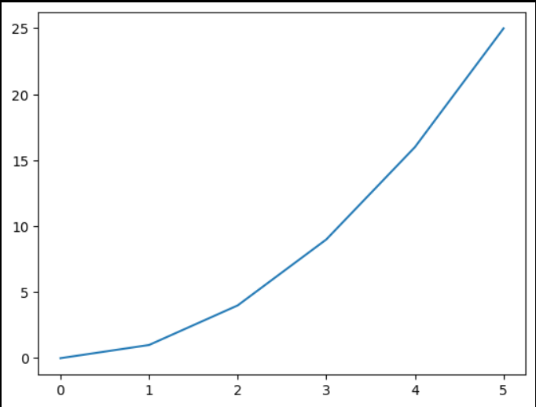

# EXNO-5-DS-DATA VISUALIZATION USING MATPLOT LIBRARY

# Aim:
  To Perform Data Visualization using matplot python library for the given datas.

# EXPLANATION:
Data visualization is the graphical representation of information and data. By using visual elements like charts, graphs, and maps, data visualization tools provide an accessible way to see and understand trends, outliers, and patterns in data.

# Algorithm:
STEP 1:Include the necessary Library.

STEP 2:Read the given Data.

STEP 3:Apply data visualization techniques to identify the patterns of the data.

STEP 4:Apply the various data visualization tools wherever necessary.

STEP 5:Include Necessary parameters in each functions.

# Coding and Output:
```
import matplotlib.pyplot as plt 
x_value =[0,1,2,3,4,5]
y_value = [0,1,4,9,16,25]
plt.plot(x_value,y_value)
plt.show()
```

```
import matplotlib.pyplot as plt
x = [1, 2, 3, 4, 5, 6, 7, 8, 9, 10]
y = [2, 4, 5, 7, 6, 8, 9, 11, 12, 12]
plt.scatter(x, y, label="stars", color="green", marker="*", s=30)
plt.xlabel('x axis')
plt.ylabel('y axis')
plt.title('My scatter plot!')
plt.legend()
plt.show()
```

```
import matplotlib.pyplot as plt
activities = ['eat', 'sleep', 'work', 'play']
slices = [3, 7, 8, 6]
colors = ['r', 'y', 'g', 'b']
plt.pie(slices, labels=activities, colors=colors,startangle=90, shadow=True, explode=(0, 0, 0.1, 0),radius=1.2, autopct='%1.1f%%')
plt.legend()
plt.show()
```

```
import matplotlib.pyplot as plt
import numpy as np
x = [1, 2, 3, 4, 5]
y1 = [10, 12, 14, 16, 18]
y2 = [5, 7, 9, 11, 13]
y3 = [2, 4, 6, 8, 10]
plt.plot(x, y1, color='red')
plt.plot(x, y2, color='black')
plt.fill_between(x, y1, color='blue')
plt.fill_between(x, y2, color='green')
plt.legend(['y1', 'y2'])
plt.show()
```

```
import matplotlib.pyplot as plt
height = [10, 24, 36, 40, 5]
names = ['one', 'two', 'three', 'four', 'five']
c1 = ['red', 'green']
plt.bar(names, height, width=0.8, color=c1)
plt.xlabel('x axis')
plt.ylabel('y axis')
plt.title('My bar chart!')
plt.show()
```

```
import matplotlib.pyplot as plt
x = [2, 1, 6, 4, 2, 4, 8, 9, 4, 2, 4, 10, 6, 4, 5, 7, 7, 3, 2, 7, 5, 3, 5, 9, 2, 1]
plt.hist(x, bins=10, color='blue', alpha=0.5)
plt.show()
```

```
import matplotlib.pyplot as plt
import numpy as np
np.random.seed(0)
data=np.random.normal(loc=0, scale=1, size=100)
fig, ax= plt.subplots()
ax.boxplot(data)
ax.set_xlabel('Data')
ax.set_ylabel('Values')
ax.set_title('Box Plot')
```

# Result:
Thus, all the data visualization techniques of matplotlib has been implemented.
